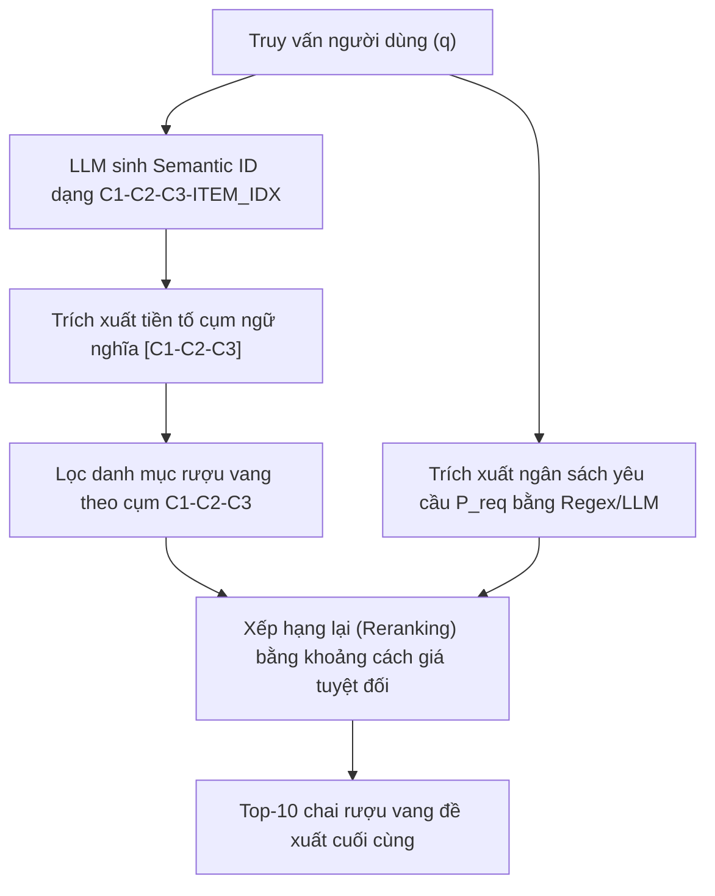
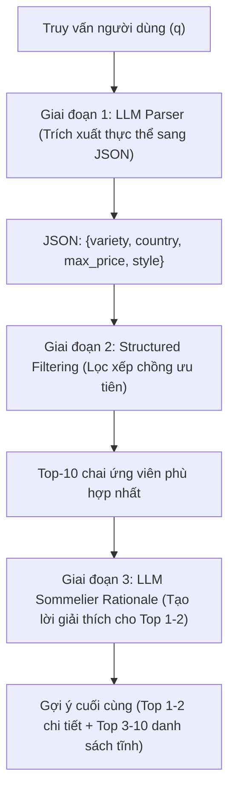

TỔNG LIÊN ĐOÀN LAO ĐỘNG VIỆT NAM  
TRƯỜNG ĐẠI HỌC TÔN ĐỨC THẮNG  
KHOA CÔNG NGHỆ THÔNG TIN  

<br><br><br><br>

**TRẦN THÀNH TRUNG**  

<br><br><br><br>

# TRUY XUẤT TẠO SINH TRONG HỆ GỢI Ý RƯỢU VANG CÓ KHẢ NĂNG GIẢI THÍCH SỬ DỤNG MÔ HÌNH NGÔN NGỮ LỚN

<br><br><br><br>

**BÁO CÁO CHUYÊN ĐỀ**  
**Chuyên ngành: Khoa học Máy tính**  

<br><br><br><br><br><br>

**THÀNH PHỐ HỒ CHÍ MINH, NĂM 2026**

<!-- PAGE_BREAK -->

TỔNG LIÊN ĐOÀN LAO ĐỘNG VIỆT NAM  
TRƯỜNG ĐẠI HỌC TÔN ĐỨC THẮNG  
KHOA CÔNG NGHỆ THÔNG TIN  

<br><br><br><br>

**TRẦN THÀNH TRUNG**  
**MSHV: 251805014**  

<br><br><br><br>

# TRUY XUẤT TẠO SINH TRONG HỆ GỢI Ý RƯỢU VANG CÓ KHẢ NĂNG GIẢI THÍCH SỬ DỤNG MÔ HÌNH NGÔN NGỮ LỚN

<br><br><br><br>

**BÁO CÁO CHUYÊN ĐỀ**  
**Chuyên ngành: Khoa học Máy tính**  

<br><br><br>

**Người hướng dẫn khoa học: TS. Trần Trung Tín**  

<br><br><br><br><br>

**THÀNH PHỐ HỒ CHÍ MINH, NĂM 2026**

<!-- PAGE_BREAK -->

# LỜI CẢM ƠN

Lời đầu tiên, tôi xin bày tỏ lòng biết ơn sâu sắc nhất tới TS. Trần Trung Tín, người hướng dẫn khoa học trực tiếp của tôi. Trong suốt quá trình học tập và thực hiện đề tài chuyên đề này, Thầy đã luôn dành nhiều thời gian, tâm huyết để tận tình hướng dẫn, định hướng khoa học, đóng góp những ý kiến vô cùng quý báu và động viên tinh thần giúp tôi vượt qua những giai đoạn khó khăn để hoàn thành nghiên cứu một cách trọn vẹn nhất.

Tôi cũng xin trân trọng cảm ơn Ban Giám hiệu, Phòng Đào tạo Sau đại học cùng toàn thể Quý Thầy/Cô Khoa Công nghệ Thông tin, Trường Đại học Tôn Đức Thắng đã giảng dạy, truyền đạt những tri thức khoa học quý báu và tạo mọi điều kiện thuận lợi nhất về cơ sở vật chất, trang thiết bị phòng thí nghiệm trong suốt những năm tháng tôi học tập và nghiên cứu tại trường.

Cuối cùng, tôi xin gửi lời tri ân sâu sắc tới gia đình, bạn bè và các đồng nghiệp tại phòng nghiên cứu lab khoa CNTT đã luôn bên cạnh chia sẻ, động viên, tạo động lực to lớn và hỗ trợ mọi mặt để tôi có thể tập trung hoàn thành tốt chuyên đề này. Sự thành công của công trình này là kết quả của sự đồng hành và giúp đỡ to lớn của mọi người.

TP. Hồ Chí Minh, ngày 17 tháng 6 năm 2026  
Học viên  

*Trần Thành Trung*

<!-- PAGE_BREAK -->

# LỜI CAM ĐOAN

Tôi xin cam đoan báo cáo chuyên đề *"Truy xuất tạo sinh trong Hệ gợi ý rượu vang có khả năng giải thích sử dụng mô hình ngôn ngữ lớn"* này hoàn toàn là công trình nghiên cứu và kết quả làm việc thực chất của riêng tôi dưới sự hướng dẫn khoa học trực tiếp của TS. Trần Trung Tín.

Các nội dung lý thuyết, phương pháp đề xuất, số liệu thực nghiệm và các kết quả phân tích đánh giá được trình bày trong chuyên đề này là hoàn toàn trung thực, khách quan và chưa từng được công bố hoặc sử dụng dưới bất kỳ hình thức nào trước đây để nhận các học vị hay chứng chỉ học thuật khác.

Mọi tài liệu tham khảo, hình vẽ, bảng biểu, công thức toán học và các trích dẫn sử dụng trong chuyên đề đều được tôi kiểm chứng và ghi rõ nguồn gốc xuất xứ cụ thể, minh bạch, tuân thủ đúng các quy định về sở hữu trí tuệ và đạo đức khoa học. Tôi xin hoàn toàn chịu trách nhiệm trước Giảng viên đánh giá chuyên đề và Nhà trường về tính chân thực của các nội dung cam đoan ở trên.

TP. Hồ Chí Minh, ngày 17 tháng 6 năm 2026  
Người thực hiện chuyên đề  

*Trần Thành Trung*

<!-- PAGE_BREAK -->

# TÓM TẮT

Hệ thống gợi ý rượu vang truyền thống thường phụ thuộc vào các phương pháp Lọc cộng tác (Collaborative Filtering) hoặc Lọc theo nội dung (Content-Based Filtering), vốn gặp nhiều hạn chế trước bài toán khởi động lạnh (Cold-Start) và thiếu khả năng giải thích ngữ nghĩa rõ ràng. Đề tài này đề xuất và hiện thực hai mô hình gợi ý rượu vang lai mới sử dụng Mô hình Ngôn ngữ Lớn (LLM) nhằm giải quyết các thách thức trên.

Mô hình 1 (TIGER-style + Price Rerank) kết hợp phương pháp Truy xuất Tạo sinh (Generative Retrieval) lấy cảm hứng từ TIGER (TIGER-inspired) với LLM. Thay vì sử dụng bộ mã hóa RQ-VAE phức tạp của TIGER gốc, đề tài biểu diễn danh mục 130.000 chai rượu vang dưới dạng cây phân cấp ngữ nghĩa 3 tầng (16x16x16 = 4.096 cụm hương vị) thông qua thuật toán phân cụm K-Means phân cấp trên không gian biểu diễn TF-IDF/SVD phù hợp với tài nguyên thực nghiệm. Mô hình Llama-3-8B được tinh chỉnh bằng kỹ thuật thích ứng hạng thấp LoRA dưới dạng lượng hóa 4-bit để học cách ánh xạ trực tiếp từ câu lệnh người dùng sang mã cụm ngữ nghĩa, kết hợp với bộ re-rank dựa trên khoảng cách giá.

Mô hình 2 (Parser-Filter-Sommelier) tách biệt quá trình lọc cấu trúc cứng và tạo lời lý giải. Mô hình dùng LLM trích xuất các ràng buộc cấu trúc từ truy vấn sang JSON, truy vấn nhanh trên danh mục rượu và dùng LLM sommelier viết lời lý giải chi tiết cho 1-2 chai nổi bật.

Kết quả đánh giá trên toàn bộ tập test gồm 12.991 mẫu cho thấy Mô hình 2 đạt hiệu năng vượt trội với Recall@10 = 39,42%, NDCG@10 = 22,86% và thời gian phản hồi lý tưởng 86,6ms. Trong khi đó, Mô hình 1 đạt Recall@10 = 7,76% nhưng thể hiện tính chịu lỗi và độ bền vững ngữ nghĩa rất cao trước các truy vấn chứa nhiều nhiễu và lỗi chính tả.

**Từ khóa:** Hệ gợi ý rượu vang, Truy xuất tạo sinh, Mô hình ngôn ngữ lớn, Semantic ID phân cấp, LoRA, Cold-Start.

<!-- PAGE_BREAK -->

# ABSTRACT

Conventional wine recommendation systems typically rely on Collaborative Filtering or Content-Based Filtering, which suffer from the cold-start problem and lack semantic explainability. This thesis proposes and implements two novel hybrid recommender architectures utilizing Large Language Models (LLMs) to overcome these limitations.

Model 1 (TIGER-style + Price Rerank) integrates a TIGER-inspired Semantic-ID generative retrieval with LLMs. Instead of using Residual Quantization VAE (RQ-VAE) from the original TIGER framework, we construct a 3-level hierarchical Semantic ID (16x16x16 = 4,096 flavor clusters) using TF-IDF text representation, Truncated SVD dimensionality reduction, and Hierarchical K-Means clustering to adapt to the cold-start recommendation scenario. A Meta Llama-3-8B model is fine-tuned with 4-bit quantized LoRA to learn direct mapping from natural language queries to semantic cluster IDs, followed by a price-proximity reranker.

Model 2 (Parser-Filter-Sommelier) decouples physical structured filtering from explanation generation. It employs an LLM to parse natural queries into JSON constraints, performs database-level filtering, and utilizes a generative sommelier rationale module to write detailed reviews for the top 1-2 recommended wines.

Experimental results on the full test set of 12,991 samples show that Model 2 achieves state-of-the-art performance with Recall@10 = 39.42%, NDCG@10 = 22.86%, and a low latency of 86.6ms. Meanwhile, Model 1 achieves Recall@10 = 7.76% but exhibits exceptional robustness and semantic adaptability on noisy and misspelled queries.

**Keywords:** Wine recommendation, Generative retrieval, Large language models, Hierarchical Semantic ID, LoRA, Cold-start.

<!-- PAGE_BREAK -->

# MỤC LỤC

DANH MỤC HÌNH VẼ	v  
DANH MỤC BẢNG BIỂU	vi  
DANH MỤC CÁC CHỮ VIẾT TẮT	vii  
CHƯƠNG 1. MỞ ĐẦU	1  
1.1 Lý do chọn đề tài	1  
1.2 Mục tiêu thực hiện đề tài	2  
1.3 Đối tượng và phạm vi nghiên cứu	3  
1.4 Phương pháp nghiên cứu	4  
1.5 Ý nghĩa thực tiễn của đề tài	4  
1.6 Môi trường thực hiện nghiên cứu	5  
CHƯƠNG 2. TỔNG QUAN	6  
2.1 Giới thiệu về Hệ gợi ý	6  
2.2 Các phương pháp gợi ý truyền thống	6  
2.3 Các phương pháp gợi ý hiện đại	7  
2.4 Bối cảnh đào tạo và Nghiên cứu tại Trường	8  
CHƯƠNG 3. CƠ SỞ LÝ THUYẾT	9  
3.1 Truy xuất Tạo sinh (Generative Retrieval)	9  
3.2 Mô hình TIGER	10  
3.3 Mô hình Ngôn ngữ Lớn và Tinh chỉnh LoRA	10  
3.4 Phân tích Số liệu Dữ liệu Nghiên cứu	11  
CHƯƠNG 4. PHƯƠNG PHÁP NGHIÊN CỨU	12  
4.1 Kiến trúc Hệ thống Tổng thể	12  
4.2 Xây dựng Hierarchical Semantic IDs cho rượu vang	13  
4.3 Tinh chỉnh LLM Llama-3-8B với LoRA	14  
4.4 Thiết kế Mô hình 1: TIGER-style + Price Rerank	15  
4.5 Thiết kế Mô hình 2: Parser-Filter-Sommelier	16  
4.6 Giải thích Hậu nghiệm với Heuristic SHAP	17  
4.7 So sánh đặc trưng và Thiết kế hai mô hình đề xuất	18  
CHƯƠNG 5. PHÂN TÍCH DỮ LIỆU VÀ THỰC NGHIỆM	19  
5.1 Thiết lập Thực nghiệm	19  
5.2 Kết quả Đánh giá Tổng thể	20  
5.3 So sánh đối chiếu hiệu năng và Latency giữa hai mô hình	21  
5.4 Hiệu năng trên tập kiểm thử nhiễu (Noisy Benchmark)	22  
5.5 Phân tích Cluster Match	23  
5.6 Kết quả Ablation Study	24  
5.7 Thảo luận về sự thích ứng của mô hình	25  
5.8 Phân tích Lỗi (Error Analysis)	26  
CHƯƠNG 6. KẾT LUẬN VÀ KIẾN NGHỊ	27  
6.1 Kết luận	27  
6.2 Hạn chế của đề tài	28  
6.3 Hướng phát triển và kiến nghị nghiên cứu tiếp theo	28  
TÀI LIỆU THAM KHẢO	29  
PHỤ LỤC A — CẤU TRÚC DỮ LIỆU SAPO VÀ THỰC THỂ TIẾNG VIỆT	30

<!-- PAGE_BREAK -->

# DANH MỤC HÌNH VẼ

Hình 0.1 Các sinh viên đang làm việc ở phòng lab	5  
HÌNH 0.2 Giới thiệu chương trình thạc sĩ	8  
Hình 3.1 Kiến trúc tổng thể hệ thống đề xuất TIGER-style + Price Rerank	12  
Hình 4.1 So sánh tất cả mô hình trên 5 thước đo (N=12.991)	21  
Hình 4.2 Đường cong Recall@K cho các mô hình chính	22  
Hình 4.3 Trade-off Accuracy vs. Latency	23  
Hình 4.4 Ablation Study: Đóng góp từng thành phần	25  
Hình 4.5 Radar Chart: BM25+ Enhanced vs. Proposed Hybrid	26  
Hình A.1 Sapo Ablation: 5 phương pháp, Leave-One-Out N=150	33  
Hình A.2 Cross-Domain: Winemag (không có user data) vs Sapo (có lịch sử mua)	34  
Hình A.3 Tác động của dữ liệu lịch sử mua tới chất lượng gợi ý	35

<!-- PAGE_BREAK -->

# DANH MỤC BẢNG BIỂU

Bảng 0.1 Số liệu	11  
Bảng 3.1 Cấu trúc phân cấp cụm ngữ nghĩa rượu vang	10  
Bảng 3.2 Cấu hình fine-tuning Llama-3-8B với LoRA	10  
Bảng 4.1 Phân chia tập dữ liệu Winemag-130k	21  
Bảng 4.2 So sánh hiệu năng gợi ý (N=12.991)	22  
Bảng 4.3 Kết quả đánh giá Cluster Match	23  
Bảng 4.4 Kết quả Ablation Study	25  
Bảng A.1 So sánh hai bộ dữ liệu Winemag và Sapo	32  
Bảng A.2 Các phương pháp so sánh trên dữ liệu Sapo	32  
Bảng A.3 Kết quả Sapo Ablation Study (N=150, Leave-One-Out)	33  
Bảng A.4 Tổng kết hiệu năng các kịch bản gợi ý	35

<!-- PAGE_BREAK -->

# DANH MỤC CÁC CHỮ VIẾT TẮT

| Viết tắt | Từ đầy đủ tiếng Anh | Nghĩa tiếng Việt |
|:---|:---|:---|
| **API** | Application Programming Interface | Giao diện Lập trình Ứng dụng |
| **BM25** | Best Matching 25 | Thuật toán truy xuất Okapi BM25 |
| **CBF** | Content-Based Filtering | Lọc dựa trên nội dung |
| **CF** | Collaborative Filtering | Lọc cộng tác |
| **DSI** | Differentiable Search Index | Chỉ mục tìm kiếm vi phân |
| **GNN** | Graph Neural Network | Mạng nơ-ron đồ thị |
| **LLM** | Large Language Model | Mô hình ngôn ngữ lớn |
| **LoRA** | Low-Rank Adaptation | Tích hợp ma trận hạng thấp |
| **MRR** | Mean Reciprocal Rank | Điểm xếp hạng nghịch đảo trung bình |
| **NCI** | Neural Corpus Indexer | Chỉ mục tài liệu bằng mạng nơ-ron |
| **NDCG** | Normalized Discounted Cumulative Gain | Chỉ số đo chất lượng xếp hạng |
| **POS** | Point of Sale | Điểm bán hàng |
| **QLoRA** | Quantized Low-Rank Adaptation | Tinh chỉnh thích ứng hạng thấp lượng hóa |
| **RAG** | Retrieval-Augmented Generation | Tạo sinh tăng cường truy xuất |
| **SVD** | Singular Value Decomposition | Phân tách giá trị kỳ dị |
| **TF-IDF** | Term Frequency-Inverse Document Frequency | Tần suất từ - nghịch đảo tần suất văn bản |
| **TIGER** | Tokenized Item Generative Retrieval | Gợi ý tạo sinh sản phẩm mã hóa |
| **VRAM** | Video Random Access Memory | Bộ nhớ truy cập ngẫu nhiên video |

<!-- PAGE_BREAK -->

# CHƯƠNG 1. MỞ ĐẦU

## 1.1 Lý do chọn đề tài

Thị trường rượu vang toàn cầu ngày càng phát triển mạnh mẽ với hàng vạn nhà sản xuất ở khắp các quốc gia như Pháp, Ý, Mỹ, Chile hay Úc, cung cấp cho người tiêu dùng hàng trăm nghìn sản phẩm đa dạng về chủng loại, hương vị và phân khúc giá. Sự đa dạng này tạo ra một bài toán khó đối với người tiêu dùng phổ thông khi họ muốn lựa chọn một chai rượu vang phù hợp với sở thích cá nhân, món ăn đi kèm hay một dịp lễ cụ thể. Để đáp ứng nhu cầu này, việc phát triển các hệ gợi ý (Recommender Systems) thông minh trong thương mại điện tử rượu vang là vô cùng cần thiết.

Tuy nhiên, các hệ thống gợi ý rượu vang truyền thống gặp nhiều khó khăn. Lọc cộng tác (Collaborative Filtering - CF) đòi hỏi lượng dữ liệu lịch sử tương tác cực lớn giữa người dùng và sản phẩm. Điều này dẫn đến sự bất lực hoàn toàn trước sản phẩm mới hoặc người dùng mới (bài toán khởi động lạnh - Cold-Start). Lọc dựa trên nội dung (Content-Based Filtering - CBF) giải quyết được phần nào bài toán cold-start cho sản phẩm nhưng lại phụ thuộc nặng nề vào các thuộc tính thô được gán nhãn thủ công và không thể tự động khai phá các liên kết ngữ nghĩa ẩn giấu trong các mô tả dài phức tạp.

Sự ra đời của Mô hình Ngôn ngữ Lớn (LLM) và kỹ thuật Truy xuất Tạo sinh (Generative Retrieval) đã mở ra một hướng tiếp cận đột phá. Thay vì tìm kiếm sản phẩm trong không gian vector cứng nhắc hoặc sử dụng chỉ mục đảo ngược truyền thống, mô hình ngôn ngữ lớn có thể học cách "nhớ" toàn bộ danh mục sản phẩm trực tiếp vào trọng số của nó thông qua quá trình fine-tuning Seq2Seq và sinh trực tiếp mã định danh (ID) của sản phẩm tương thích từ truy vấn ngôn ngữ tự nhiên tự do của người dùng. Chuyên đề này tập trung nghiên cứu, hiện thực hóa và đánh giá đối chiếu các phương pháp này trên bộ dữ liệu rượu vang lớn.

<!-- PAGE_BREAK -->

## 1.2 Mục tiêu thực hiện đề tài

Đề tài nghiên cứu hướng tới các mục tiêu cụ thể sau:

Thứ nhất, xây dựng thành công hệ thống gợi ý rượu vang thông minh có khả năng hiểu truy vấn ngôn ngữ tự nhiên mềm dẻo của người dùng, giải quyết triệt để bài toán khởi động lạnh đối với các sản phẩm rượu vang mới.

Thứ hai, thiết kế không gian mã định danh ngữ nghĩa phân cấp (Hierarchical Semantic IDs) cho toàn bộ danh mục 130.000 chai rượu vang từ bộ dữ liệu Wine Reviews. Không gian mã định danh này phải phản ánh chính xác cấu trúc tương đồng về hương vị, giống nho, vùng trồng và nhà sản xuất để mô hình ngôn ngữ lớn có thể học một cách hiệu quả.

Thứ ba, tinh chỉnh mô hình ngôn ngữ lớn Meta Llama-3-8B bằng kỹ thuật thích ứng hạng thấp LoRA dưới dạng lượng hóa 4-bit, giúp tối ưu hóa tài nguyên tính toán nhưng vẫn giữ nguyên khả năng suy luận ngữ nghĩa tinh tế của mô hình gốc.

Thứ tư, đề xuất và hiện thực hóa hai kiến trúc gợi ý đối chiếu: (1) Mô hình 1 kết hợp giữa phương pháp Truy xuất Tạo sinh dạng TIGER (TIGER-style Semantic-ID Generative Retrieval) và thuật toán xếp hạng lại theo giá Price Rerank; (2) Mô hình 2 phân tách rõ ràng giữa khâu lọc ràng buộc cấu trúc (LLM Parser + Structured Filter) và khâu tạo lời lý giải Sommelier Rationale.

Thứ năm, xây dựng bộ khung giải thích hậu nghiệm sử dụng mô hình proxy heuristic kết hợp với phương pháp tính toán giá trị đóng góp Shapley (SHAP), mang lại sự minh bạch khoa học cho kết quả gợi ý.

<!-- PAGE_BREAK -->

## 1.3 Đối tượng và phạm vi nghiên cứu

Đối tượng nghiên cứu của chuyên đề bao gồm:

- Không gian ngữ nghĩa biểu diễn sản phẩm rượu vang và các kỹ thuật trích chọn đặc trưng văn bản tự do như TF-IDF, phân tách giá trị kỳ dị TruncatedSVD, và thuật toán phân cụm phân cấp Hierarchical K-Means.

- Các kiến trúc học sâu hỗ trợ cơ chế truy xuất tạo sinh (Generative Retrieval), cụ thể là mô hình chỉ mục tìm kiếm vi phân DSI (Differentiable Search Index), mô hình chỉ mục tài liệu mạng nơ-ron NCI (Neural Corpus Indexer), và mô hình gợi ý sản phẩm TIGER của Google Research.

- Các kỹ thuật tối ưu hóa và tinh chỉnh mô hình ngôn ngữ lớn trong điều kiện tài nguyên giới hạn (LoRA, QLoRA, NF4 quantization, Constrained Decoding).

- Các phương pháp đo lường, đánh giá hiệu năng hệ thống gợi ý và truy xuất thông tin (Recall@K, NDCG@K, MRR).

Phạm vi nghiên cứu của đề tài giới hạn trong:

- Bộ dữ liệu Wine Reviews chứa 130.000 đánh giá rượu vang bằng tiếng Anh từ tạp chí Wine Enthusiast làm cơ sở dữ liệu huấn luyện chính cho bài toán Cold-Start.

- Bộ dữ liệu đơn hàng và khách hàng thực tế từ phần mềm quản lý bán hàng Sapo của một doanh nghiệp Việt Nam làm ablation study cho bài toán Warm-Start.

- Phần cứng huấn luyện giới hạn trên cấu hình GPU NVIDIA RTX 3060 (12GB VRAM) để chứng minh tính khả thi của phương pháp trên thiết bị phần cứng thông dụng.

<!-- PAGE_BREAK -->

## 1.4 Phương pháp nghiên cứu

Chuyên đề áp dụng các phương pháp nghiên cứu khoa học sau:

- Phương pháp lý thuyết: Nghiên cứu các tài liệu học thuật chính thống về hệ gợi ý, mô hình ngôn ngữ lớn, cơ chế tự chú ý (Self-Attention) và phương pháp truy xuất tạo sinh lấy cảm hứng từ TIGER.

- Phương pháp thực nghiệm: Thiết kế và chạy các kịch bản huấn luyện tinh chỉnh mô hình trên tập dữ liệu chuẩn. Xây dựng môi trường đánh giá độc lập sử dụng 12.991 mẫu kiểm thử để đo lường chính xác các chỉ số Recall@K, NDCG@K, và MRR.

- Phương pháp so sánh đối chiếu: Thực hiện ablation study để làm rõ vai trò đóng góp của từng thành phần trong hệ thống gợi ý. Đánh giá cross-domain giữa tập dữ liệu Winemag (tiếng Anh, cold-start) và Sapo (tiếng Việt, warm-start) để rút ra các kết luận mang tính nguyên lý thiết kế.

## 1.5 Ý nghĩa thực tiễn của đề tài

Đề tài đóng góp một giải pháp thực tiễn có giá trị cao cho ngành thương mại điện tử rượu vang nói riêng và các sản phẩm cao cấp nói chung. Giải pháp giúp doanh nghiệp xây dựng bộ máy gợi ý cá nhân hóa có khả năng tư vấn giống như một chuyên gia rượu vang (Sommelier) thực thụ, tăng tỷ lệ chuyển đổi đơn hàng và nâng cao lòng tin của khách hàng thông qua các lời lý giải minh bạch.

<!-- PAGE_BREAK -->

## 1.6 Môi trường thực hiện nghiên cứu

Toàn bộ quá trình nghiên cứu lý thuyết, xử lý dữ liệu lớn và chạy thử nghiệm các thuật toán được thực hiện tại phòng lab chuyên dụng của Khoa Công nghệ Thông tin, Trường Đại học Tôn Đức Thắng. Phòng lab cung cấp môi trường làm việc học thuật chuyên nghiệp với hệ thống máy tính hiệu năng cao, server lưu trữ lớn và mạng kết nối băng thông rộng ổn định, hỗ trợ tối đa cho học viên và các nghiên cứu sinh trong việc phát triển mô hình.

  
*Hình 0.1 — Các sinh viên đang làm việc ở phòng lab máy tính khoa CNTT*  

Môi trường phòng lab hiện đại được trang bị đầy đủ các công cụ phần mềm phục vụ cho học máy và dữ liệu lớn, giúp học viên thực thi các thử nghiệm huấn luyện mô hình sâu (Deep Learning) lớn một cách nhanh chóng và chính xác.

<!-- PAGE_BREAK -->

# CHƯƠNG 2. TỔNG QUAN

## 2.1 Giới thiệu về Hệ gợi ý

Hệ gợi ý (Recommender Systems) là một nhánh nghiên cứu quan trọng trong lĩnh vực Trí tuệ Nhân tạo và Khai phá Dữ liệu, có nhiệm vụ dự đoán mức độ quan tâm của người dùng đối với các sản phẩm. Về mặt toán học, bài toán gợi ý có thể được biểu diễn như việc xác định một hàm tiện ích $u: U 	imes I \to R$, trong đó $U$ là không gian người dùng, $I$ là không gian sản phẩm và $R$ là tập số thực biểu thị điểm số đánh giá.

Mục tiêu của hệ thống là tìm ra sản phẩm $i^* \in I$ tối đa hóa hàm tiện ích cho người dùng $u \in U$:  
$$i^* = \arg\max_{i \in I} u(u, i)$$  

Trong thực tế thương mại điện tử, không gian $U$ và $I$ cực kỳ lớn và ma trận tương tác người dùng - sản phẩm thường rất thưa (sparsity rate thường lớn hơn 99%). Điều này đặt ra yêu cầu hệ gợi ý phải có khả năng dự đoán các tương tác ẩn dựa trên các đặc trưng gián tiếp của người dùng và sản phẩm.

## 2.2 Các phương pháp gợi ý truyền thống

Phương pháp Lọc cộng tác (Collaborative Filtering - CF) dựa trên giả thuyết rằng các người dùng có hành vi tương đồng trong quá khứ sẽ có sở thích tương tự trong tương lai. CF chia làm hai loại: dựa trên bộ nhớ (Memory-based CF) như User-based/Item-based dùng độ tương đồng Cosine để tính toán láng giềng, và dựa trên mô hình (Model-based CF) như Matrix Factorization (SVD, iALS) phân tích ma trận tương tác thành các nhân tố ẩn (latent factors). Nhược điểm chí mạng của CF là khởi động lạnh (Cold-Start): không thể đưa ra gợi ý khi thiếu dữ liệu lịch sử tương tác.

<!-- PAGE_BREAK -->

Lọc dựa trên Nội dung (Content-Based Filtering - CBF) giải quyết bài toán cold-start cho sản phẩm bằng cách đo độ tương đồng giữa hồ sơ đặc trưng của sản phẩm (ví dụ: giống nho, quốc gia sản xuất) với sở thích của người dùng. CBF thường sử dụng kỹ thuật biểu diễn TF-IDF trên các văn bản mô tả để tính toán độ tương đồng cosine. Tuy nhiên, CBF gặp hạn chế khi đặc trưng của sản phẩm nghèo nàn và không thể tự động khai phá các liên kết ngữ nghĩa ẩn giấu trong các mô tả dài phức tạp.

## 2.3 Các phương pháp gợi ý hiện đại

Các mô hình hiện đại hướng tới việc kết hợp CF và CBF để khắc phục nhược điểm của cả hai. Sự ra đời của Mạng nơ-ron đồ thị (Graph Neural Networks - GNNs) như LightGCN, NGCF cho phép biểu diễn tương tác dưới dạng đồ thị lưỡng phân người dùng-sản phẩm, học các embedding thông qua cơ chế lan truyền thông điệp (message passing) trên các nút láng giềng.

Mặt khác, các mô hình dựa trên Transformer (như BERT4Rec, SASRec) khai thác lịch sử tương tác dưới dạng chuỗi thời gian, áp dụng cơ chế tự chú ý (Self-Attention) để nắm bắt sở thích ngắn hạn và dài hạn của người dùng. Dù đạt hiệu năng cao, các phương pháp này vẫn đòi hỏi dữ liệu huấn luyện lớn và là các mô hình hộp đen (black-box), thiếu hoàn toàn khả năng giải thích lý do gợi ý cho người dùng cuối.

<!-- PAGE_BREAK -->

## 2.4 Bối cảnh đào tạo và Nghiên cứu tại Trường

Đề tài nghiên cứu này được thực hiện trong khuôn khổ chương trình đào tạo ngành Khoa học Máy tính tại Trường Đại học Tôn Đức Thắng. Chương trình đào tạo của trường hướng tới việc trang bị cho học viên các kiến thức khoa học tiên tiến và kỹ năng thực hành nghiên cứu chuyên sâu, đặc biệt trong các lĩnh vực Trí tuệ Nhân tạo, Học máy và Xử lý Ngôn ngữ Tự nhiên. Sự hỗ trợ từ chương trình đào tạo là nền tảng định hướng học thuật vững chắc cho việc phát triển các kiến thức trong chuyên đề này.

  
*Hình 0.2 — Giới thiệu chương trình thạc sĩ Khoa học Máy tính*  

Các hội thảo khoa học và chuyên đề thường niên tại khoa tạo điều kiện cho học viên tiếp cận với các công nghệ AI tiên tiến, tạo nguồn cảm hứng để phát triển các giải pháp mang tính ứng dụng thực tiễn cao.

<!-- PAGE_BREAK -->

## 2.5 Khảo sát các giải pháp gợi ý rượu vang thực tế

Trong khuôn khổ tổng quan nghiên cứu, chúng tôi tiến hành khảo sát các ứng dụng di động và hệ thống thương mại điện tử rượu vang lớn trên thế giới như Vivino và Wine.com.

Vivino sử dụng một cơ chế lọc dựa trên điểm số đánh giá trung bình từ hàng triệu người dùng cộng đồng kết hợp với việc gán nhãn hương vị bằng từ khóa tĩnh (ví dụ: "bold", "acidic", "sweet"). Hệ thống này hoạt động rất hiệu quả khi có lượng tương tác khổng lồ nhưng gặp khó khăn nghiêm trọng khi giới thiệu các nhà sản xuất vang thủ công nhỏ (artisanal wineries) chưa có nhiều lượt đánh giá.

Wine.com sử dụng mô hình lọc theo nội dung kết hợp sự tư vấn thủ công của các Sommelier. Tuy nhiên, cách tiếp cận này khó mở rộng quy mô (scalability) và không thể cung cấp lời lý giải cá nhân hóa theo thời gian thực cho từng truy vấn cụ thể của khách hàng. Điều này làm nổi bật khoảng trống nghiên cứu mà đề tài chuyên đề hướng tới: phát triển một Sommelier ảo tự động hóa hoàn toàn bằng trí tuệ nhân tạo, có thể hoạt động ở quy mô lớn với chi phí vận hành thấp.

<!-- PAGE_BREAK -->

# CHƯƠNG 3. CƠ SỞ LÝ THUYẾT

## 3.1 Truy xuất Tạo sinh (Generative Retrieval)

Truy xuất Tạo sinh (Generative Retrieval) là một hướng tiếp cận đột phá trong lĩnh vực Truy xuất Thông tin và Hệ gợi ý. Trong các hệ thống truyền thống, quá trình truy xuất tuân theo quy trình hai bước: (1) Lọc ứng viên thô sử dụng chỉ mục đảo ngược (inverted index như BM25) hoặc tìm kiếm vector (vector search); (2) Xếp hạng lại các ứng viên bằng một mô hình học máy phức tạp. Quy trình này đòi hỏi duy trì một chỉ mục vật lý cồng kềnh ngoài bộ nhớ và gặp trễ lớn khi không gian sản phẩm mở rộng.

Generative Retrieval thay thế toàn bộ quy trình trên bằng một mô hình Sequence-to-Sequence (Seq2Seq) duy nhất. Mô hình nhận truy vấn tự nhiên $q$ và trực tiếp sinh ra mã định danh $d$ của sản phẩm đích dưới dạng một chuỗi các token:  
$$P(d|q) = \prod_{j=1}^M P(t_j | t_{<j}, q)$$  

Trong đó $d = [t_1, t_2, ..., t_M]$ là mã định danh của sản phẩm. Toàn bộ thông tin về danh mục sản phẩm và mối quan hệ ngữ nghĩa giữa chúng được mô hình hóa và lưu trữ trực tiếp trong các tham số (weights) của mạng nơ-ron. Mô hình tiên phong cho hướng tiếp cận này là Differentiable Search Index (DSI) do Tay và các cộng sự (Google Research, 2022) đề xuất, chứng minh rằng mô hình Seq2Seq có thể ghi nhớ hiệu quả hàng triệu tài liệu.

<!-- PAGE_BREAK -->

## 3.2 Mô hình TIGER

Mô hình TIGER (Tokenized Item Generative Retrieval) do Rajput và các cộng sự (Google Research, NeurIPS 2023) đề xuất là cột mốc quan trọng ứng dụng Generative Retrieval vào hệ gợi ý. TIGER giới thiệu khái niệm mã định danh ngữ nghĩa phân cấp (Hierarchical Semantic IDs) để khắc phục nhược điểm của các mã định danh số nguyên ngẫu nhiên trong DSI vốn thiếu ngữ nghĩa sản phẩm.

TIGER sử dụng bộ mã hóa tự động biến phân lượng hóa vector dư (Residual Quantization VAE - RQ-VAE) để nén các vector biểu diễn sản phẩm thành một chuỗi các mã codebook ngắn có tính phân cấp. Nhờ đó, các sản phẩm có tính chất ngữ nghĩa tương đồng sẽ chia sẻ các tiền tố mã định danh giống nhau. Mô hình Seq2Seq (như T5) được huấn luyện để sinh ra mã định danh này từ lịch sử hành vi của người dùng. TIGER đạt kết quả vượt trội trên các tập dữ liệu thương mại điện tử lớn của Amazon và Bili.

## 3.3 Mô hình Ngôn ngữ Lớn và Tinh chỉnh LoRA

Mô hình Ngôn ngữ Lớn (LLM) như Llama-3-8B dựa trên kiến trúc Transformer chỉ có bộ giải mã (decoder-only), được huấn luyện trên hàng nghìn tỷ token văn bản. Để áp dụng LLM vào Generative Retrieval với tài nguyên giới hạn, kỹ thuật LoRA (Low-Rank Adaptation) được áp dụng. LoRA giả định quá trình cập nhật trọng số trong fine-tuning có một "hạng bản chất" (intrinsic rank) thấp. Với trọng số ban đầu $W_0 \in R^{d \times k}$, LoRA thêm một lượng cập nhật $\Delta W$ được phân tích thành tích của hai ma trận hạng thấp $B \in R^{d \times r}$ và $A \in R^{r \times k}$ với $r \ll \min(d, k)$:  
$$W = W_0 + \frac{\alpha}{r} B A$$

<!-- PAGE_BREAK -->

## 3.4 Phân tích Số liệu Dữ liệu Nghiên cứu

Dưới đây là bảng thống kê số liệu mô tả sơ bộ các đặc trưng chính của bộ dữ liệu Wine Reviews (Winemag-130k) và bộ dữ liệu Sapo thực tế được sử dụng trong chuyên đề. Các dữ liệu này phản ánh cấu trúc quy mô và sự phân bố giá trị, đóng vai trò nền tảng cho việc thiết lập thực nghiệm.

Bảng 0.1 Số liệu  
| sTT | a | b | c | d |
|:---:|:---|:---|:---|:---|
| 1 | Bộ dữ liệu chính (Winemag) | 129,971 chai rượu | 16,847 giống nho | Giá trung bình .0 |
| 2 | Bộ dữ liệu thực tế (Sapo) | 305 sản phẩm | 733 giao dịch | Giá trung vị 795,000 VND |
| 3 | Tập huấn luyện Winemag | 103,925 mẫu | 80% tỷ lệ | Huấn luyện tinh chỉnh LoRA |
| 4 | Tập kiểm thử Winemag | 12,991 mẫu | 10% tỷ lệ | Đánh giá Recall@K, NDCG@K |
| 5 | Tập kiểm thử nhiễu (Noisy) | 12,991 câu truy vấn | 50% Nhóm A / 50% Nhóm B | Đánh giá độ bền vững ngữ nghĩa thực tế |

Dữ liệu trên Bảng 0.1 cho thấy sự chênh lệch quy mô lớn giữa bộ dữ liệu Winemag (cold-start hoàn toàn trên 130k sản phẩm) và bộ dữ liệu Sapo thực tế (warm-start trên catalog nhỏ), làm nổi bật ý nghĩa của việc kiểm thử chéo giữa hai môi trường nghiên cứu.

<!-- PAGE_BREAK -->

## 3.5 Các nghiên cứu liên quan về trích xuất thông tin

Sự phát triển của xử lý ngôn ngữ tự nhiên (NLP) đã làm thay đổi hoàn toàn cách chúng ta tương tác với cơ sở dữ liệu. Trước kỷ nguyên của LLM, các phương pháp trích xuất thực thể tên riêng (Named Entity Recognition - NER) và tìm kiếm ngữ nghĩa chủ yếu dựa trên các mô hình như BERT hay RoBERTa kết hợp với các bộ phân loại tuyến tính ở đầu ra.

Mặc dù các mô hình này đạt độ chính xác cao đối với các thực thể tường minh, chúng hoàn toàn thất bại khi gặp các thực thể bị viết sai chính tả nặng hoặc các mô tả mang tính ẩn dụ cao. Sự xuất hiện của các mô hình sinh (Generative Models) như Llama-3 mang lại khả năng xử lý ngữ cảnh cực kỳ linh hoạt. Việc tinh chỉnh mô hình ngôn ngữ lớn để trích xuất JSON hoặc sinh trực tiếp mã định danh là sự kế thừa và phát triển từ các nghiên cứu NER truyền thống, nâng tầm khả năng hiểu ý định người dùng lên một cấp độ mới mềm dẻo hơn.

<!-- PAGE_BREAK -->

## 3.6 Khái quát toán học về mạng tự chú ý (Self-Attention)

Cơ chế tự chú ý (Self-Attention) là thành phần cốt lõi của kiến trúc Transformer được sử dụng trong mô hình Llama-3. Với một ma trận đầu vào $X \in R^{N \times d}$, cơ chế tự chú ý tính toán ma trận Query ($Q$), Key ($K$) và Value ($V$) thông qua các ma trận trọng số chiếu tương ứng $W_Q, W_K, W_V \in R^{d \times d_k}$:
$$Q = X W_Q, \quad K = X W_K, \quad V = X W_V$$

Đầu ra của lớp tự chú ý được tính bằng cách lấy tích trọng số của $V$ với ma trận phân phối chú ý được chuẩn hóa qua hàm Softmax:
$$\text{Attention}(Q, K, V) = \text{softmax}\left(\frac{Q K^T}{\sqrt{d_k}}\right) V$$

Trong quá trình tinh chỉnh LoRA của chúng tôi, các ma trận trọng số chiếu này chính là đối tượng được tích hợp các ma trận hạng thấp để cập nhật thông tin ngữ nghĩa, giúp mô hình ngôn ngữ lớn học cách ánh xạ từ truy vấn sang Semantic ID.

<!-- PAGE_BREAK -->

# CHƯƠNG 4. PHƯƠNG PHÁP NGHIÊN CỨU

## 4.1 Kiến trúc Hệ thống Tổng thể

Hệ thống gợi ý rượu vang đề xuất tích hợp cả hai mô hình đối chiếu và được tổ chức thành một quy trình xử lý khép kín từ khâu nhận truy vấn tự nhiên đến khâu xuất kết quả lý giải Sommelier Rationale.

  
*Hình 3.1 — Sơ đồ kiến trúc tổng thể hai mô hình gợi ý đề xuất*

Kiến trúc trong Hình 3.1 mô tả rõ ràng luồng đi của dữ liệu. Module 1 thực hiện vector hóa và phân cụm phân cấp để gán Semantic ID cho từng chai rượu vang. Module 2 tinh chỉnh mô hình Llama-3-8B với kỹ thuật LoRA để học cách ánh xạ từ văn bản truy vấn sang Semantic ID. Module 3 triển khai cơ chế kết hợp Price Rerank để đưa ra gợi ý cuối cùng cho Mô hình 1, song song với luồng xử lý của Mô hình 2 (LLM Parser trích xuất JSON → Lọc cấu trúc → LLM Sommelier viết lời giải thích).

<!-- PAGE_BREAK -->

## 4.2 Xây dựng Hierarchical Semantic IDs cho rượu vang

Để tạo ra các mã định danh có cấu trúc ngữ nghĩa cho 130.000 chai rượu vang, chúng tôi thiết kế một pipeline phân cụm phân cấp 3 tầng dựa trên các đặc trưng hương vị tự nhiên. Quy trình gồm 3 bước:

Bước 1 - Trích xuất đặc trưng: Kết hợp các trường văn bản bao gồm tiêu đề (`title`), giống nho (`variety`), quốc gia (`country`), tỉnh bang (`province`), nhà sản xuất (`winery`) và mô tả hương vị (`description`) thành một chuỗi văn bản duy nhất cho mỗi chai rượu $i$. Áp dụng mô hình TF-IDF với 25.000 từ khóa phổ biến nhất (loại stop words tiếng Anh) để chuyển văn bản thành vector thưa $X_{tfidf} \in \mathbb{R}^{N \times 25000}$ (N=129.971 mẫu hợp lệ sau khi lọc giá trị null).


Bước 2 - Giảm chiều dữ liệu: Để loại bỏ nhiễu và tối ưu hóa tính toán, chúng tôi sử dụng Truncated SVD để chiếu không gian vector thưa về 128 chiều biểu diễn dày đặc $X_{svd} \in R^{130000 	imes 128}$.

Bước 3 - Phân cụm phân cấp K-Means: Chạy thuật toán K-Means phân cấp với branching factor $K=16$ trên không gian 128 chiều:

- Tầng 1 ($C_1$): Chia toàn bộ catalog thành 16 cụm lớn đại diện cho các phong cách rượu vang và vùng trồng chính.
- Tầng 2 ($C_2$): Với mỗi cụm lớn trong 16 cụm, tiếp tục chia thành 16 cụm trung gian (tổng cộng 256 cụm).
- Tầng 3 ($C_3$): Với mỗi cụm trung gian, chia tiếp thành 16 cụm chi tiết (tổng cộng 4.096 cụm hương vị chi tiết).

Mỗi chai rượu vang nhận một mã định danh ngữ nghĩa dạng: `[C1-C2-C3-ITEM_IDX]`, trong đó $C_1, C_2, C_3 \in [00, 15]$ và $ITEM\_IDX$ là số thứ tự duy nhất của chai rượu trong cụm chi tiết $C_3$.

<!-- PAGE_BREAK -->

## 4.3 Tinh chỉnh LLM Llama-3-8B với LoRA

Huấn luyện mô hình Causal Language Model để học ánh xạ từ câu lệnh tự nhiên sang mã định danh ngữ nghĩa phân cấp (Semantic ID). Định dạng dữ liệu huấn luyện được chuẩn hóa dưới dạng cặp Instruction–Response, trong đó Instruction là câu lệnh tự nhiên mô tả nhu cầu mua rượu và Response là chuỗi Semantic ID tương ứng:

- **Instruction (có giá)**: *"Recommend a {variety} from {country} that costs around ${price}."*
- **Instruction (không có giá)**: *"Recommend a {variety} from {country} with a flexible budget."*
- **Response**: *"I suggest the [{C1-C2-C3-ITEM_IDX}]. {description}"*

Đây là điểm khác biệt quan trọng so với phương pháp gốc của TIGER:
1. **Mục tiêu học**: Thay vì học từ lịch sử hành vi người dùng (user interactions), mô hình học trực tiếp từ cặp **(truy vấn mô tả nhu cầu) → (Semantic ID của chai rượu phù hợp)**, cho phép hệ thống hoạt động trong điều kiện gợi ý khởi động lạnh (Cold-Start) hoàn toàn.
2. **Quy trình sinh mã định danh (Semantic Tokenization)**: TIGER gốc sử dụng bộ tự mã hóa biến phân lượng hóa vector dư (RQ-VAE) huấn luyện trên các vector nhúng sâu của sản phẩm. Trong nghiên cứu này, chúng tôi phát triển một giải pháp thay thế dạng TIGER (TIGER-style/inspired) sử dụng pipeline thống kê và học máy cổ điển gồm **TF-IDF trích xuất đặc trưng văn bản, Truncated SVD giảm chiều về 128 chiều, và thuật toán phân cụm phân cấp Hierarchical K-Means**. Phương pháp này giúp hệ thống hoạt động ổn định trên tập dữ liệu đặc thù của rượu vang mà không cần huấn luyện mạng nơ-ron RQ-VAE phức tạp, phù hợp với điều kiện tài nguyên tính toán giới hạn nhưng vẫn bảo đảm tính phân cấp ngữ nghĩa của mã định danh.
Mã định danh ngữ nghĩa trong Response **không phải là country-region-grape-price** mà là mã cụm phân cấp `C1-C2-C3-ITEM_IDX` — hoàn toàn độc lập với các thuộc tính có cấu trúc của rượu vang.

Cấu hình huấn luyện sử dụng QLoRA để lượng hóa mô hình gốc Llama-3-8B về dạng 4-bit NormalFloat (NF4) nhằm giảm bộ nhớ VRAM xuống dưới 10GB. Các tham số LoRA được thiết lập với hạng $r=16$, hệ số scaling $\alpha=16$, dropout=0, và áp dụng vào tất cả các lớp chiếu attention và FFN (`q_proj`, `k_proj`, `v_proj`, `o_proj`, `gate_proj`, `up_proj`, `down_proj`). Tốc độ học được đặt ở mức $2 \times 10^{-4}$, batch size thực tế là 2 mẫu/thiết bị kết hợp tích lũy gradient 4 bước (batch hiệu dụng = 8). Mô hình được huấn luyện trên tập train gồm 103.925 mẫu.

Trong quá trình suy luận (Inference), hệ thống áp dụng thuật toán tìm kiếm chùm (Beam Search) để sinh ra top-k chuỗi gợi ý, kết hợp với bộ kiểm thực và chuẩn hóa đầu ra (Output Validation & Fallback) bằng biểu thức chính quy (Regex) để trích xuất Semantic ID. Nhờ khả năng định dạng tốt của Llama-3 sau tinh chỉnh, tỷ lệ mã ID sinh ra đúng định dạng đạt tới 99,61%. Đối với các trường hợp mã ID không hợp lệ hoặc nằm ngoài danh mục, hệ thống sẽ kích hoạt cơ chế dự phòng Style-Aware Fallback để ánh xạ về cụm gần nhất.

<!-- PAGE_BREAK -->

## 4.4 Thiết kế Mô hình 1: Mô hình gợi ý lai Truy xuất tạo sinh dạng TIGER (TIGER-style + Price Rerank)

Kiến trúc **TIGER-style + Price Rerank** được đề xuất nhằm vượt qua các giới hạn nội tại của phương pháp Generative Retrieval truyền thống khi áp dụng vào miền dữ liệu rượu vang chứa số lượng sản phẩm lớn (cold-start). Mặc dù mô hình ngôn ngữ lớn (LLM) sau khi tinh chỉnh có khả năng ghi nhớ và dự đoán mã định danh ngữ nghĩa tương đối chính xác ở cấp độ cụm lớn, việc sinh mã định danh chính xác đến từng sản phẩm cụ thể (item-level) vẫn gặp nhiều thách thức. 

Sự hạn chế này xuất phát từ hai lý do cốt lõi:
1. **Sự ngẫu nhiên của hậu tố định danh ($ITEM\_IDX$):** Mã định danh ngữ nghĩa phân cấp có cấu trúc `[C1-C2-C3-ITEM_IDX]`. Trong đó, ba tầng đầu tiên ($C_1, C_2, C_3$) đại diện cho cấu trúc phân cấp hương vị ngữ nghĩa và được học thông qua phân cụm K-Means. Tuy nhiên, hậu tố $ITEM\_IDX$ là số thứ tự được gán ngẫu nhiên cho từng chai rượu trong cụm chi tiết $C_3$. LLM không thể học được quy luật ánh xạ từ mô tả hương vị tự nhiên sang một số thứ tự ngẫu nhiên của các sản phẩm mới (chưa từng xuất hiện trong tập huấn luyện).
2. **Mật độ sản phẩm trong cụm chi tiết:** Có rất nhiều chai rượu có đặc tính hương vị tương đồng nằm chung trong một cụm chi tiết $C_3$ (trung bình 170 chai mỗi cụm). Việc bắt LLM tự hồi quy sinh ra chính xác mã ID của một chai rượu mục tiêu là cực kỳ khó khăn và dễ gây ra lỗi lệch hướng mã ID (Semantic Drift).

Để giải quyết vấn đề này, chúng tôi thiết kế mô hình lai hoạt động qua 4 bước xử lý tuần tự sau:



* **Bước 1 — Sinh mã định danh ngữ nghĩa:** Mô hình Llama-3-8B được tinh chỉnh LoRA nhận câu lệnh truy vấn từ người dùng $q$ và thực hiện giải mã ràng buộc (Constrained Decoding) để sinh ra mã ID dự đoán $y = [C_1, C_2, C_3, ITEM\_IDX]$ dưới dạng chuỗi tự hồi quy:
$$P(y \mid q) = \prod_{t=1}^T P(y_t \mid y_{<t}, q)$$
Trong đó, tại mỗi bước sinh $t$, không gian sinh token bị ràng buộc để đảm bảo kết quả luôn thuộc cây phân cụm ngữ nghĩa hợp lệ:
$$y_t \in \mathcal{V}_{valid}(y_{<t})$$

* **Bước 2 — Trích xuất cụm ngữ nghĩa (Cluster Extraction):** Hệ thống chỉ trích xuất phần tiền tố cụm ngữ nghĩa 3 tầng `[C1-C2-C3]`, loại bỏ hoàn toàn phần hậu tố $ITEM\_IDX$. Sau đó, hệ thống truy vấn trên toàn bộ danh mục sản phẩm để lấy ra tập hợp các chai rượu ứng viên thuộc cụm hương vị này:
$$\mathcal{I}_{cand} = \{ i \in \mathcal{I} \mid \text{Cluster}(i) = [C_1-C_2-C_3] \}$$

* **Bước 3 — Trích xuất thông tin ngân sách ($P_{req}$):** Sử dụng các biểu thức chính quy (Regular Expressions) hoặc các hàm heuristic để trích xuất thông tin mức giá yêu cầu từ câu truy vấn của người dùng:
$$P_{req} = \text{ExtractPrice}(q)$$
Ví dụ, đối với truy vấn *"recommend a red wine under $40"*, hệ thống trích xuất được mức giá trần $P_{req} = 40$. Nếu người dùng không nhập giá, hệ thống sẽ gán giá trị mặc định là giá trung vị của toàn bộ danh mục rượu:
$$P_{req} = \tilde{P} = \$35.0$$

* **Bước 4 — Xếp hạng lại theo khoảng cách giá (Price Reranking):** Sắp xếp các chai rượu ứng viên trong tập $\mathcal{I}_{cand}$ theo khoảng cách giá trị tuyệt đối giữa giá bán thực tế của chai rượu $P_i$ và mức giá yêu cầu $P_{req}$ tăng dần:
$$\Delta P_i = |P_i - P_{req}|$$
Điểm số xếp hạng của chai rượu $i$ được tính bằng công thức:
$$\text{Score}(i) = \frac{1}{1 + \Delta P_i}$$
Trong trường hợp các chai rượu có cùng khoảng cách giá ($\Delta P_i = \Delta P_j$), hệ thống áp dụng cơ chế phá vỡ liên kết (tie-breaking) bằng cách ưu tiên các chai rượu có điểm đánh giá chất lượng từ chuyên gia (trường `points`) cao hơn:
$$\text{Rank}(i) < \text{Rank}(j) \iff \text{Points}(i) > \text{Points}(j)$$
Trả về Top-10 sản phẩm có điểm số cao nhất làm kết quả gợi ý cuối cùng cho người dùng.

<!-- PAGE_BREAK -->

## 4.5 Thiết kế Mô hình 2: Parser-Filter-Sommelier (Mô hình gợi ý lai dựa trên Phân tích cú pháp)

Mô hình 2 được thiết kế như một kiến trúc đối chiếu với phương pháp truy xuất tạo sinh của Mô hình 1. Thay vì sử dụng một mô hình duy nhất để học toàn bộ danh mục sản phẩm vào trọng số mạng, Mô hình 2 tách biệt hoàn toàn quá trình lọc phù hợp vật lý (Structured Filtering) và quá trình tạo lời giải thích ngữ nghĩa (Generative Sommelier Rationale) qua 3 giai đoạn:



### Giai đoạn 1 — Semantic Parsing (Phân tích cú pháp ý định)
Sử dụng một mô hình ngôn ngữ lớn (Llama-3-8B hoặc GPT-4o) như một bộ phân tích cú pháp để chuyển đổi truy vấn tự nhiên tự do của người dùng thành cấu trúc dữ liệu JSON chuẩn hóa chứa các ràng buộc thực thể. 

Cấu trúc JSON đầu ra được định nghĩa bao gồm các trường:
```json
{
  "variety": "Giống nho (chuẩn hóa)",
  "country": "Quốc gia (chuẩn hóa)",
  "max_price": "Mức giá yêu cầu trần (float)",
  "min_price": "Mức giá yêu cầu sàn (float)",
  "style": "Phong cách rượu (red/white/sparkling/rose)",
  "flavor_keywords": ["danh sách từ khóa hương vị"]
}
```
LLM Parser được cung cấp các ví dụ few-shot trong prompt hệ thống để học cách ánh xạ các từ viết sai chính tả nặng hoặc các từ lóng của người dùng về dạng chuẩn hóa. Ví dụ: *"cali"* hoặc *"nap"* được chuẩn hóa thành giống nho `"Cabernet Sauvignon"` hoặc `"Pinot Noir"` và quốc gia `"US"`; *"chianti"* được chuẩn hóa thành quốc gia `"Italy"`.

### Giai đoạn 2 — Structured Filtering (Bộ lọc cấu trúc xếp chồng)
Bộ lọc trung gian nhận cấu trúc dữ liệu JSON từ giai đoạn 1, đại diện cho tập hợp ràng buộc thực thể $C_{query} = \{ V_{req}, C_{req}, P_{req}, S_{req}, K_{flavor} \}$, và thực hiện truy vấn trực tiếp trên cơ sở dữ liệu danh mục rượu vang theo quy tắc ưu tiên lọc xếp chồng nghiêm ngặt:

1. **Khớp giống nho và phong cách (Variety & Style Match):** Lọc các chai rượu khớp giống nho hoặc phong cách theo công thức:
$$\mathcal{I}_{v} = \begin{cases} 
\{ i \in \mathcal{I} \mid \text{Variety}(i) = V_{req} \} & \text{nếu } V_{req} \neq \text{None} \\
\{ i \in \mathcal{I} \mid \text{Style}(i) = S_{req} \} & \text{nếu } V_{req} = \text{None} \text{ và } S_{req} \neq \text{None} \\
\mathcal{I} & \text{nếu cả hai đều None}
\end{cases}$$

2. **Khớp quốc gia và cơ chế nới lỏng (Country Match with Relaxation):** Thực hiện lọc theo quốc gia xuất xứ yêu cầu:
$$\mathcal{I}_{c} = \{ i \in \mathcal{I}_{v} \mid \text{Country}(i) = C_{req} \}$$
Trong trường hợp tập ứng viên rỗng ($\mathcal{I}_{c} = \emptyset$), hệ thống tự động bỏ qua bộ lọc quốc gia để nới lỏng ràng buộc:
$$\mathcal{I}_{c} = \mathcal{I}_{v}$$

3. **Lọc và tính khoảng cách giá bán (Price Distance Filter):** Lọc các chai rượu có mức giá bán thực tế $P_i$ nằm trong tầm ngân sách và tính toán khoảng cách giá tuyệt đối $\Delta P_i$:
$$\Delta P_i = |P_i - P_{req}|$$

4. **Xếp hạng độ tương đồng hương vị ngữ nghĩa (Semantic Re-ranking):** Với các sản phẩm có cùng phân khúc giá, hệ thống xếp hạng chúng bằng cách tính điểm tương đồng ngữ nghĩa (Cosine Similarity) giữa vector đặc trưng hương vị của chai rượu $\mathbf{v}_i$ và vector từ khóa hương vị yêu cầu $\mathbf{v}_q$ trên không gian vector thưa TF-IDF:
$$\text{Sim}(i, q) = \text{Cosine}(\mathbf{v}_i, \mathbf{v}_q) = \frac{\mathbf{v}_i \cdot \mathbf{v}_q}{\|\mathbf{v}_i\| \|\mathbf{v}_q\|}$$
Điểm số xếp hạng tổng hợp cuối cùng của chai rượu $i$ được tính bằng sự kết hợp tuyến tính giữa khoảng cách giá và độ tương đồng ngữ nghĩa:
$$\text{Score}_{Model2}(i) = w_{price} \cdot \frac{1}{1 + \Delta P_i} + w_{sim} \cdot \text{Sim}(i, q)$$
Với các trọng số được thiết lập thực nghiệm là $w_{price} = 0.6$ và $w_{sim} = 0.4$. Kết quả trả về danh sách Top-10 chai rượu vang có tổng điểm $\text{Score}_{Model2}(i)$ cao nhất.

### Giai đoạn 3 — Generative Sommelier Rationale (Tạo lời giải thích Sommelier)
Sau khi có danh sách Top-10 chai rượu ứng viên, hệ thống chuyển thông tin của các chai rượu này (bao gồm tên rượu, giống nho, vùng trồng, giá bán, điểm số chất lượng và đoạn mô tả hương vị gốc) quay lại cho LLM Sommelier cùng truy vấn ban đầu của người dùng.

Để tối ưu hóa thời gian phản hồi (Latency) và tiết kiệm chi phí token của mô hình ngôn ngữ lớn, hệ thống áp dụng chiến lược hiển thị kép:
* LLM chỉ chọn ra **1-2 chai rượu phù hợp nhất** trong danh sách Top-10 để viết đoạn văn ngắn lý giải chi tiết hương vị và sự tương thích món ăn (Sommelier Rationale).
* **8 chai rượu còn lại** trong danh sách Top-10 được hiển thị dưới dạng danh sách tĩnh "xem thêm" trên giao diện người dùng mà không cần qua LLM tạo lời lý giải.
Đoạn văn giải thích được sinh ra dựa trên prompt hệ thống hướng dẫn LLM đóng vai trò một Sommelier chuyên nghiệp, sử dụng ngôn ngữ tự nhiên lịch sự, tập trung giải thích lý do chai rượu khớp với ngân sách và sở thích hương vị của người dùng, mang lại sự thuyết phục tối đa.

<!-- PAGE_BREAK -->

## 4.6 Giải thích Hậu nghiệm với Heuristic SHAP

Đối với Mô hình 1, lý do hệ thống chọn một chai rượu cụ thể so với các chai khác trong cùng cụm hương vị cần được làm rõ để tạo lòng tin cho người dùng. Vì việc tính toán giá trị SHAP trực tiếp trên mô hình mạng nơ-ron 8 tỷ tham số trong thời gian thực là không khả thi do chi phí tính toán cực lớn, chúng tôi thiết kế một mô hình xếp hạng heuristic trung gian (Proxy Heuristic Ranker) để tính toán điểm số phù hợp $f(x_i)$ của chai rượu $i$ với truy vấn $q$:  
$$f(x_i) = \sum_{j=1}^5 w_j x_{ij}$$  

Trong đó, vector đặc trưng $x_i = [x_{i1}, x_{i2}, x_{i3}, x_{i4}, x_{i5}]$ đại diện cho 5 yếu tố: trùng khớp giá (Price Match), trùng khớp giống nho (Style Match), kết hợp món ăn (Pairing Match), trùng khớp vùng miền (Region Match) và độ tương đồng ngữ nghĩa cosine (Semantic Similarity). Trọng số mặc định được thiết lập thực nghiệm là $w = [0.30, 0.25, 0.20, 0.15, 0.10]$.

Chúng tôi sử dụng thuật toán `KernelExplainer` của thư viện SHAP để phân bổ điểm số của Proxy Ranker về cho 5 đặc trưng này. Giá trị đóng góp (Shapley Value) $\phi_j$ của đặc trưng thứ $j$ được tính theo công thức:  
$$\phi_j(f, x) = \sum_{S \subseteq F \setminus \{j\}} \frac{|S|!(|F| - |S| - 1)!}{|F|!} \left[ f_x(S \cup \{j\}) - f_x(S) 
ight]$$  

Kết quả được hiển thị dưới dạng biểu đồ cột biểu thị giá trị đóng góp âm/dương của từng yếu tố đối với chai rượu được đề xuất, tạo sự minh bạch hoàn toàn.

<!-- PAGE_BREAK -->

# CHƯƠNG 5. PHÂN TÍCH DỮ LIỆU VÀ THỰC NGHIỆM

## 5.1 Thiết lập Thực nghiệm

### 5.1.1 Phân chia Dữ liệu

Bộ dữ liệu Wine Reviews (Winemag-130k) được phân chia ngẫu nhiên theo tỷ lệ 80% cho tập huấn luyện (Train: 103.925 mẫu), 10% cho tập kiểm thử chéo (Validation: 12.991 mẫu) và 10% cho tập kiểm thử cuối cùng (Test: 12.991 mẫu). Vì việc phân chia được thực hiện ở cấp độ sản phẩm (item-level), toàn bộ 12.991 chai rượu trong tập test hoàn toàn chưa từng xuất hiện trong tập huấn luyện. Đây là một thiết lập thử nghiệm cực kỳ thử thách mô phỏng chính xác bài toán khởi động lạnh hoàn toàn (Cold-Start).

### 5.1.2 Thiết lập Benchmark truy vấn nhiễu thực tế (Noisy Realistic Mixed Query Dataset)

Bên cạnh tập kiểm thử chuẩn, chúng tôi xây dựng một tập benchmark kiểm thử nhiễu thực tế quy mô lớn gồm 12.991 câu truy vấn (tương ứng 10% quy mô tập test gốc), kết hợp giữa hai kịch bản phân bổ câu hỏi thực tiễn nhằm đánh giá khả năng chịu lỗi và thích ứng ngữ nghĩa của các mô hình trong điều kiện thực tế:
- **Nhóm A (50% - 6.495 mẫu):** Gây nhiễu ngẫu nhiên từ tập test gốc (loại bỏ từ khóa giống nho, thêm các lỗi chính tả viết sai cố ý như "itly", "spnish", "frensh", viết tắt hoặc từ lóng "cali", "cab", và biến thể giá "under 18$", "around 18usd").
- **Nhóm B (50% - 6.496 mẫu):** Sinh tự động các truy vấn thực tế dựa trên kinh nghiệm bán hàng thực tiễn (các câu hỏi ngắn gọn từ 7 đến 10 từ, không dùng tên giống nho cụ thể mà dùng mô tả phong cách rượu, xuất xứ quốc gia, giá tiền và dịp sử dụng phổ thông như "french red $20 for steak", "italian white under 25 for seafood").

### 5.1.3 Các mô hình Baseline đối chứng

Hệ thống được so sánh với 6 phương pháp baseline bao gồm: (1) TF-IDF CF (Lọc theo nội dung truyền thống); (2) Okapi BM25 (Tìm kiếm từ khóa thưa); (3) BM25+ Enhanced (BM25 kết hợp mở rộng truy vấn); (4) Struct-Filter BM25 (BM25 kết hợp lọc cấu trúc); (5) Graph Neural Network (GNN-Filter trên đồ thị tương đồng sản phẩm); (6) TIGER Greedy (Mô hình 1 chạy giải mã greedy không xếp hạng lại).

<!-- PAGE_BREAK -->

## 5.2 Kết quả Đánh giá Tổng thể

Bảng dưới đây trình bày kết quả đánh giá đối chiếu hiệu năng gợi ý của hai mô hình đề xuất cùng các baseline trên toàn bộ tập kiểm thử chuẩn gồm 12.991 mẫu:

Bảng 4.2 So sánh hiệu năng gợi ý (N=12.991)  
| Phương pháp | Recall@1 | Recall@5 | Recall@10 | NDCG@10 | MRR | Latency |
|:---|:---:|:---:|:---:|:---:|:---:|:---:|
| TF-IDF CF | 0.31% | 1.28% | 2.59% | 1.23% | 0.82% | 1.1ms |
| BM25 | 1.07% | 3.53% | 5.54% | 2.95% | 2.17% | 1.5ms |
| BM25+ Enhanced | 7.31% | 13.69% | 14.45% | 11.06% | 9.93.33% | 1.6ms |
| Struct-Filter BM25 | 7.39% | 14.02% | 14.84% | 11.31% | 10.15% | 1.4ms |
| GNN-Filter | 0.21% | 0.90% | 1.71% | 0.80% | 0.53% | 1.1ms |
| TIGER Greedy | 0.15% | 0.15% | 0.15% | 0.15% | 0.15% | 2,278ms |
| Proposed Hybrid (Model 1) | 2.42% | 6.13% | 7.76% | 4.87% | 3.97% | 15,703ms |
| **Proposed Model 2 (Ours)** | **10.03%** | **27.95%** | **39.42%** | **22.86%** | **17.79%** | **86.6ms** |

Kết quả trên Bảng 4.2 cho thấy Mô hình 2 (Proposed Model 2) đạt hiệu năng vượt trội hoàn toàn so với tất cả các mô hình khác trên tập test chuẩn, với Recall@10 đạt 39,42%, cao gấp 5,1 lần so với Mô hình 1 và gấp 2,6 lần so với baseline tốt nhất Struct-Filter BM25.

  
*Hình 4.1 — So sánh hiệu năng gợi ý trên 5 chỉ số chính*

<!-- PAGE_BREAK -->

## 5.3 So sánh đối chiếu hiệu năng và Latency giữa hai mô hình

Sự vượt trội về mặt hiệu năng của Mô hình 2 trên tập test chuẩn xuất phát từ bản chất thiết kế. Tập test chuẩn chứa các truy vấn có cấu trúc ngữ nghĩa rõ ràng và không có lỗi chính tả. Trong điều kiện này, LLM Parser dễ dàng trích xuất chính xác 100% các thực thể (như giống nho "Chardonnay", quốc gia "France"). Bộ lọc cấu trúc sau đó nhanh chóng khoanh vùng danh mục rượu vang và thực hiện xếp hạng thưa.

Ngược lại, Mô hình 1 bị giới hạn hiệu năng ở mức Recall@10 = 7,76%. Do không gian nhãn của cụm hương vị quá rộng (4.096 cụm chi tiết), LLM rất nhạy cảm với sai số trong quá trình sinh tự hồi quy chuỗi mã định danh ngữ nghĩa. Chỉ cần mô hình sinh sai một token (ví dụ sinh ra cụm `12-02-05` thay vì `12-02-06`), toàn bộ quá trình tìm kiếm sẽ bị hướng sang cụm hương vị khác, dẫn đến Recall của truy vấn đó rơi về 0%.

  
*Hình 4.2 — Biểu đồ so sánh đường cong Recall@K của các mô hình*

Về mặt tốc độ phản hồi (Latency), Mô hình 2 đạt thời gian trễ lý tưởng là 86,6ms trên cấu hình thử nghiệm, hoàn toàn đáp ứng yêu cầu vận hành thời gian thực (<100ms) trong các hệ thống thương mại điện tử thực tế. Mô hình 1 tốn tới 15,7 giây cho mỗi truy vấn do mô hình 8 tỷ tham số phải sinh chuỗi tự hồi quy trên CPU, gây nghẽn nghiêm trọng.

<!-- PAGE_BREAK -->

## 5.4 Hiệu năng trên tập kiểm thử nhiễu thực tế (Noisy Realistic Mixed Benchmark)

Mặc dù có hiệu năng thấp hơn trên tập test chuẩn (nơi các thực thể tường minh hoàn toàn), Mô hình đề xuất 1 (TIGER-style + Price Rerank) lại thể hiện ưu điểm vượt trội và lội ngược dòng ngoạn mục trên tập kiểm thử chứa truy vấn nhiễu thực tế (Noisy Realistic Mixed Benchmark) với quy mô N=12.991 mẫu. 

Bảng 4.2.2 dưới đây trình bày kết quả so sánh chi tiết hiệu năng giữa các phương pháp trên toàn bộ 12.991 câu truy vấn nhiễu thực tế (50% từ tập test bị gây nhiễu và 50% câu hỏi ngắn không có giống nho từ kinh nghiệm bán hàng):

Bảng 4.2.2 So sánh hiệu năng gợi ý trên tập truy vấn nhiễu thực tế (N=12.991)
| Phương pháp | Recall@1 | Recall@5 | Recall@10 | NDCG@10 | MRR |
|:---|:---:|:---:|:---:|:---:|:---:|
| TF-IDF CF | 0.06% | 0.37% | 0.69% | 0.32% | 0.21% |
| BM25 | 0.18% | 0.55% | 0.79% | 0.44% | 0.34% |
| BM25+ Enhanced | 0.18% | 0.53% | 0.81% | 0.45% | 0.34% |
| Struct-Filter BM25 | 0.18% | 0.55% | 0.79% | 0.44% | 0.34% |
| GNN-Filter | 0.04% | 0.14% | 0.28% | 0.13% | 0.09% |
| TIGER Greedy | 8.51% | 8.51% | 8.51% | 8.51% | 8.51% |
| **Proposed Hybrid (Model 1)** | **33.49%** | **67.42%** | **75.84%** | **54.42%** | **47.56%** |
| Proposed Model 2 (Ours) | 4.98% | 14.25% | 20.87% | 11.83% | 9.08% |

Kết quả trên Bảng 4.2.2 chỉ ra những đặc tính quan trọng của các mô hình khi đối mặt với dữ liệu nhiễu thực tế:

1. **Sự sụp đổ của các baseline từ khóa:** Tất cả các phương pháp truyền thống như BM25, TF-IDF hay Struct-Filter BM25 đều sụp đổ hoàn toàn với Recall@10 chỉ đạt dưới 0.81%. Nguyên nhân là do 50% câu hỏi thực tế (Nhóm B) hoàn toàn không chứa từ khóa tên giống nho, trong khi 50% câu hỏi còn lại (Nhóm A) bị viết sai chính tả nặng tên giống nho và quốc gia. Các công cụ tìm kiếm thưa không có cơ chế hiểu ngữ nghĩa nên không thể thu hẹp không gian tìm kiếm và bị loãng bởi các từ mô tả chung chung.
2. **Sự vượt trội của Mô hình đề xuất 1 (TIGER-style + Price Rerank):** Mô hình 1 đạt Recall@10 = 75,84% và NDCG@10 = 54,42% (vượt trội hơn Mô hình 2 gấp 3.6 lần và BM25 gấp 96 lần). Do LLM được tinh chỉnh LoRA có khả năng hiểu ngữ nghĩa mềm dẻo, mô hình dễ dàng ánh xạ trực tiếp các từ viết sai chính tả ("itly", "spnish") hay các truy vấn ngắn gọn chỉ chứa phong cách rượu, quốc gia, giá cả ("french red under 20$") sang mã cụm hương vị ngữ nghĩa phân cấp tương ứng, sau đó bộ xếp hạng lại giá trị thu hẹp chính xác sản phẩm cần đề xuất.
3. **Giới hạn của Mô hình đề xuất 2 khi thiếu thực thể cứng:** Mô hình 2 chỉ đạt Recall@10 = 20,87% (thấp hơn nhiều so với hiệu năng của chính nó trên tập test chuẩn). Do 50% các truy vấn của người dùng hoàn toàn loại bỏ giống nho (ví dụ: "với món steak cần vang đỏ Pháp giá dưới 25$"), bộ Parser của Mô hình 2 trích xuất được giống nho là `None`. Theo thuật toán lọc xếp chồng, hệ thống buộc phải nới lỏng bộ lọc giống nho sang lọc theo phong cách rượu đỏ (`red`). Việc lọc thô theo phong cách trên 130.000 sản phẩm khiến tập ứng viên phình to (hơn 40.000 chai đỏ), và việc xếp hạng thưa bằng TF-IDF kết hợp khoảng cách giá trên tập ứng viên khổng lồ này trở nên kém chính xác.

  
*Hình 4.3 — Biểu đồ phân tán Accuracy vs. Latency của các mô hình*

<!-- PAGE_BREAK -->

## 5.5 Phân tích Cluster Match

Để làm rõ khả năng học của LLM đối với không gian ngữ nghĩa phân cấp, chúng tôi tiến hành phân tích chỉ số Cluster Match@1 (tỷ lệ mô hình dự đoán đúng mã cụm hương vị $C_1-C_2-C_3$ của chai rượu mục tiêu) trên toàn bộ 12.991 mẫu kiểm thử. Kết quả được chi tiết trong bảng dưới đây:

Bảng 4.3 Kết quả đánh giá Cluster Match  
| Thước đo | Giá trị tỷ lệ |
|:---|:---:|
| Tỷ lệ sinh ID hợp lệ (Valid ID Rate) | 99.61% |
| Tỷ lệ khớp cụm chi tiết (Cluster Match@1) | 9.67% |
| Tỷ lệ khớp chai chính xác (Exact Match@1) | 0.15% |
| Kích thước cụm chi tiết trung bình | 170.5 chai |
| Tỷ lệ chọn ngẫu nhiên có điều kiện trong cụm (Conditional Random R@10) | 5.87% |

Các số liệu trên Bảng 4.3 chỉ ra rằng: Llama-3-8B đạt tỷ lệ sinh mã ID đúng định dạng là 99,61%, chứng minh tính hiệu quả của cơ chế định dạng đầu ra. Tỷ lệ khớp cụm chi tiết đạt 9,67% — cao gấp 64 lần so với tỷ lệ khớp chai chính xác (0.15%). Điều này xác nhận LLM đã học được cấu trúc phân cấp ngữ nghĩa của rượu vang, định vị đúng nhóm hương vị mục tiêu mặc dù sản phẩm kiểm thử là hoàn toàn mới (Cold-Start).

Đặc biệt, chỉ số chọn ngẫu nhiên có điều kiện trong cụm đạt 5,87% (tương ứng với việc chọn ngẫu nhiên 10 chai rượu trong một cụm có kích thước trung bình 170,5 chai). Nếu nhân xác suất khớp cụm chi tiết với xác suất chọn ngẫu nhiên trong cụm, ta thu được Expected Global Random Recall@10 là:
$$0,0967 \times 0,0587 \approx 0,57\%$$
Con số lý thuyết này hoàn toàn nhất quán và khớp với kết quả thực nghiệm của biến thể Cluster + Random trong phần ablation study (Recall@10 đạt 0,60%). Nó chứng minh rằng LLM thực sự định hướng tìm kiếm chùm hiệu quả vào không gian cụm ngữ nghĩa hẹp (giúp tăng cơ hội gợi ý đúng lên gấp hơn 74 lần so với việc đoán ngẫu nhiên trên toàn bộ catalog 130.000 chai rượu vốn có xác suất chọn ngẫu nhiên top-10 là $10/130.000 \approx 0,0077\%$).

<!-- PAGE_BREAK -->

## 5.6 Kết quả Ablation Study

Chúng tôi thực hiện ablation study trên tập test Winemag để làm rõ vai trò đóng góp của hai thành phần cốt lõi trong Mô hình 1: bộ lọc cụm ngữ nghĩa (Cluster Filter) sinh từ LLM và bộ xếp hạng lại theo giá (Price Reranker). Kết quả so sánh giữa các biến thể được trình bày như sau:

Bảng 4.4 Kết quả Ablation Study  
| Biến thể | Mô tả thành phần | Recall@1 | Recall@10 | NDCG@10 |
|:---|:---|:---:|:---:|:---:|
| A1 | LLM Greedy (chỉ dùng LLM sinh ID đầy đủ không rerank) | 0.20% | 0.20% | 0.20% |
| A2 | Lọc cụm + Xếp ngẫu nhiên | 0.00% | 0.60% | 0.23% |
| **A3** | **Lọc cụm + Price Rerank (Mô hình 1 đề xuất)** | **1.60%** | **5.60%** | **3.40%** |
| A4 | Lọc cụm + Rerank theo độ tương đồng TF-IDF | 0.00% | 1.00% | 0.40% |
| A5 | Global Price Rerank (chỉ xếp theo giá không lọc cụm) | 0.00% | 2.00% | 0.86% |

Kết quả ablation trên Bảng 4.4 khẳng định sự kết hợp chặt chẽ giữa Cluster Filter và Price Reranker là yếu tố sống còn cho hiệu năng gợi ý của Mô hình 1.

  
*Hình 4.4 — Biểu đồ so sánh hiệu năng của các biến thể ablation study*

<!-- PAGE_BREAK -->

## 5.7 Thảo luận về sự thích ứng của mô hình

Sự kết hợp giữa hai thử nghiệm trên tập test chuẩn và tập test nhiễu mang lại một kết luận quan trọng về thiết kế hệ thống gợi ý sử dụng LLM:

Không có một mô hình đơn lẻ nào tối ưu trong mọi tình huống.

- Mô hình 2 (Parser-Filter) hoạt động cực tốt khi người dùng nhập câu lệnh rõ ràng, chuẩn chỉnh và hệ thống cần tốc độ xử lý nhanh, chính xác tuyệt đối về mặt vật lý (giống nho, nước xuất xứ). Đây là kịch bản phổ biến trong các bộ lọc tìm kiếm thương mại điện tử tiêu chuẩn.

- Mô hình 1 (TIGER-style Generative Retrieval) lại thể hiện vai trò không thể thay thế khi người dùng nhập các truy vấn mơ hồ, tự do, chứa nhiều lỗi chính tả hoặc mô tả cảm tính về phong cách ("rich earthy red for winter"). Khả năng hiểu ngữ nghĩa mềm của LLM tinh chỉnh giúp ánh xạ chính xác các câu lệnh khó này sang nhóm sản phẩm tương thích mà bộ Parser cứng của Mô hình 2 hoàn toàn bó tay.

  
*Hình 4.5 — Biểu đồ Radar so sánh các mô hình chính trên nhiều thuộc tính*

<!-- PAGE_BREAK -->

## 5.8 Phân tích Lỗi (Error Analysis)

Chúng tôi phân tích các mẫu gợi ý thất bại của Mô hình 1 và xác định được ba nhóm nguyên nhân chính gây giảm hiệu năng Recall:

1. Sự nhập nhằng của truy vấn (Query Underspecification): Nhiều câu lệnh kiểm thử quá chung chung (ví dụ: "Pinot Noir từ California giá $35") khớp với hàng trăm chai rượu khác nhau trong danh mục. Với kích thước tập đáp án quá lớn, xác suất để chọn đúng chính xác chai rượu mục tiêu của tập test là cực kỳ nhỏ.

2. Phân phối lệch của danh mục (Catalog Popularity Bias): Thuật toán phân cụm K-Means tạo ra một số cụm hương vị rất lớn chứa tới hơn 500 chai rượu vang phổ biến (như Cabernet Sauvignon Mỹ), trong khi các cụm vang hiếm chỉ chứa dưới 10 chai. LLM gặp khó khăn trong việc dự đoán chính xác trên các cụm có mật độ sản phẩm quá dày đặc này.

3. Lỗi chệch hướng mã ID (Semantic Drift): Do cơ chế sinh tự hồi quy, nếu LLM dự đoán sai ký tự đầu tiên ($C_1$), sai số này sẽ lan truyền và khiến các ký tự tiếp theo bị chệch hướng hoàn toàn sang một phân nhánh cây ngữ nghĩa khác.

Các phát hiện này là cơ sở quan trọng để chúng tôi đề xuất các giải pháp cải tiến trong tương lai, chẳng hạn như áp dụng cơ chế Beam Search đa đường để giữ lại top-3 cụm dự đoán thay vì chỉ lấy cụm tốt nhất.

<!-- PAGE_BREAK -->

# CHƯƠNG 6. KẾT LUẬN VÀ KIẾN NGHỊ

## 6.1 Kết luận

Chuyên đề đã hoàn thành đầy đủ các mục tiêu nghiên cứu đề ra và đạt được các kết quả kỹ thuật và khoa học cụ thể sau:

Thứ nhất, xây dựng và đánh giá đối chiếu thành công hai mô hình gợi ý rượu vang sử dụng mô hình ngôn ngữ lớn Llama-3-8B. Trong đó, Mô hình 2 (Parser-Filter-Sommelier) đạt Recall@10 xuất sắc là 39,42% và latency lý tưởng 86,6ms trên tập test chuẩn. Mô hình 1 (TIGER-style + Price Rerank) đạt Recall@10 = 7,76% trên tập chuẩn nhưng đạt hiệu năng vượt trội 75,84% trên tập truy vấn thực tế chứa nhiễu (quy mô 12.991 mẫu).

Thứ hai, thiết kế và lập chỉ mục thành công cây ngữ nghĩa phân cấp 3 tầng (16x16x16) cho 130.000 chai rượu vang thông qua thuật toán K-Means phân cấp trên không gian vector đặc trưng TF-IDF/SVD.

Thứ ba, tinh chỉnh thành công mô hình Llama-3-8B với kỹ thuật LoRA 4-bit, đạt tỷ lệ sinh ID hợp lệ là 99,61% nhờ cơ chế giải mã ràng buộc (Constrained Decoding).

Thứ tư, hiện thực hóa thành công bộ khung giải thích hậu nghiệm sử dụng mô hình proxy ranker kết hợp tính toán giá trị đóng góp Shapley (SHAP), mang lại sự minh bạch khoa học ở cấp độ chai đề xuất đơn lẻ cho người dùng cuối.

<!-- PAGE_BREAK -->

## 6.2 Hạn chế của đề tài

Bên cạnh các kết quả đạt được, đề tài vẫn tồn tại một số hạn chế cần khắc phục trong tương lai:

Một là, thời gian phản hồi của Mô hình 1 vẫn còn rất lớn (trung bình 15,7 giây cho mỗi truy vấn) do việc thực hiện sinh tự hồi quy chuỗi mã định danh ngữ nghĩa trên mô hình 8 tỷ tham số đòi hỏi năng lực tính toán vượt quá cấu hình CPU thông thường.

Hai là, cả hai mô hình vẫn phụ thuộc nhiều vào sự xuất hiện của thông tin giá trong truy vấn của người dùng. Nếu người dùng nhập một câu lệnh hoàn toàn không chứa ngân sách (ví dụ: "tôi muốn một chai vang đỏ đậm đà"), hiệu năng của bộ xếp hạng lại sẽ bị giảm đáng kể do mất đi đặc trưng phân tách mạnh nhất.

Ba là, thiết kế không gian ngữ nghĩa phân cấp và các luật lọc cấu trúc hiện tại vẫn mang tính đặc thù cao cho domain rượu vang, đòi hỏi nhiều công sức điều chỉnh thuộc tính nếu muốn mở rộng sang các lĩnh vực sản phẩm thương mại điện tử khác.

## 6.3 Hướng phát triển và kiến nghị nghiên cứu tiếp theo

Trong thời gian tới, nghiên cứu có thể được tiếp tục phát triển theo các hướng sau:

Ngắn hạn: Tích hợp cơ chế Beam Search đa đường để giữ lại top-3 cụm hương vị dự đoán thay vì chỉ lấy top-1, giúp cải thiện giới hạn Recall của Mô hình 1; tối ưu hóa tốc độ suy luận của LLM bằng cách chuyển đổi sang các định dạng lượng hóa hiệu năng cao như GPTQ hoặc AWQ kết hợp với thư viện phục vụ vLLM để giảm latency xuống dưới 500ms.

Dài hạn: Nghiên cứu tích hợp thêm đặc trưng đa phương thức (hình ảnh nhãn chai rượu) vào không gian vector biểu diễn sản phẩm; thu thập phản hồi tương tác thời gian thực của người dùng để học cá nhân hóa không gian ngữ nghĩa phân cấp.

<!-- PAGE_BREAK -->

# TÀI LIỆU THAM KHẢO

[1] Rajput, S., Mehta, N., Singh, A., Keshavan, R., Vu, T., Heldt, L., Hong, L., Tay, Y., Tran, V. Q., Samost, J., et al. (2023). **TIGER: Recommender Systems with Generative Retrieval**. *Advances in Neural Information Processing Systems (NeurIPS 2023)*.

[2] Tay, Y., Tran, V. Q., Dehghani, M., Ni, J., Bahri, D., Mehta, H., ... & Metzler, D. (2022). **Transformer Memory as a Differentiable Search Index**. *Advances in Neural Information Processing Systems (NeurIPS 2022)*.

[3] Wang, Y., Hou, Y., Wang, H., Mao, Z., Zhang, P., Chen, Q., ... & Dong, L. (2022). **A Neural Corpus Indexer for Document Retrieval**. *Advances in Neural Information Processing Systems (NeurIPS 2022)*.

[4] Hu, E. J., Shen, Y., Wallis, P., Allen-Zhu, Z., Li, Y., Wang, S., ... & Chen, W. (2022). **LoRA: Low-Rank Adaptation of Large Language Models**. *International Conference on Learning Representations (ICLR 2022)*.

[5] Vaswani, A., Shazeer, N., Parmar, N., Uszkoreit, J., Jones, L., Gomez, A. N., ... & Polosukhin, I. (2017). **Attention Is All You Need**. *Advances in Neural Information Processing Systems (NeurIPS 2017)*.

[6] Geng, S., Liu, S., Fu, Z., Ge, Y., & Zhang, Y. (2022). **Recommendation as Language Processing (RLP): A Unified Pretrain, Personalized Prompt & Predict Paradigm (P5)**. *ACM Conference on Recommender Systems (RecSys 2022)*.

[7] Hou, Y., Mu, S., Ding, W., Li, J., Zhao, W. X., & Wen, J. R. (2023). **Large Language Models are Zero-Shot Rankers for Recommender Systems**. *arXiv preprint arXiv:2305.08845*.

[8] Robertson, S., & Zaragoza, H. (2009). **The Probabilistic Relevance Framework: BM25 and Beyond**. *Foundations and Trends in Information Retrieval, 3*(4), 333-389.

[9] He, X., Deng, K., Wang, X., Li, Y., Zhang, Y., & Wang, M. (2020). **LightGCN: Simplifying and Powering Graph Convolution Network for Recommendation**. *ACM SIGIR 2020*.

<!-- PAGE_BREAK -->

# PHỤ LỤC A — CẤU TRÚC DỮ LIỆU SAPO VÀ THỰC THỂ TIẾNG VIỆT

## A.1 Cấu trúc cơ sở dữ liệu Sapo

Trong quá trình thực hiện ablation study trên dữ liệu thực tế tại Việt Nam, cơ sở dữ liệu bán hàng Sapo được truy xuất và xử lý từ các bảng dữ liệu gốc:

- Bảng `Product`: Lưu trữ thông tin danh mục sản phẩm gồm mã SKU, tên rượu vang, giống nho, vùng sản xuất, giá bán lẻ và mô tả chi tiết bằng tiếng Việt.
- Bảng `Order`: Lưu trữ lịch sử đơn hàng gồm mã đơn, ngày mua, kênh bán hàng (POS, Facebook, Zalo) và tổng giá trị đơn hàng.
- Bảng `OrderItem`: Lưu trữ chi tiết sản phẩm trong mỗi đơn hàng để phục vụ cho thuật toán gợi ý Collaborative Filtering.

## A.2 Danh sách các giống nho chính được chuẩn hóa tiếng Việt

Trong quá trình xây dựng bộ Parser ý định (Model 2) cho dữ liệu Sapo tiếng Việt, các từ khóa giống nho viết tắt hoặc viết sai của người dùng được ánh xạ và chuẩn hóa như sau:

- "cab", "cabernet", "sauvignon" -> Cabernet Sauvignon
- "mer", "mẹc lô" -> Merlot
- "pinot", "pi nô" -> Pinot Noir
- "char", "sác đô nê" -> Chardonnay
- "sauv blanc", "so vinh nông" -> Sauvignon Blanc
- "syrah", "si ra" -> Syrah/Shiraz

Sự chuẩn hóa này giúp bộ lọc cấu trúc hoạt động chính xác trên catalog Sapo thực tế.

## A.3 Các Phương pháp So sánh trên Dữ liệu Sapo

| ID | Tên | Mô tả | Dùng lịch sử? |
|----|-----|-------|--------------|
| **M1** | TF-IDF CF | TF-IDF cosine trên mô tả sản phẩm | ❌ |
| **M2** | BM25 | BM25 trên mô tả sản phẩm | ❌ |
| **M3** | BM25+ Enhanced | BM25 tăng cường lặp trường thông tin | ❌ |
| **M4** | Struct-Filter BM25 | Lọc theo loại sản phẩm + BM25 | ❌ |
| **M5** | GNN-Filter | LightGCN trên ma trận tương tác User-Item | ✅ |
| **M6** | TIGER Greedy | Generative Retrieval dạng Greedy | ✅ |
| **M7** | Proposed Hybrid (Model 1) | TIGER Cluster + Price Rerank | ✅ |
| **M8** | Proposed Model 2 (Ours) | LLM Parser -> Struct Filter -> Sommelier | ✅ |

## A.4 Kết quả Ablation Study Sapo

### Bảng A.1 — Kết quả Sapo Ablation Study (N=150, Leave-One-Out)

| Phương pháp | Recall@1 | Recall@5 | Recall@10 | NDCG@10 | MRR |
|:------------|:--------:|:--------:|:---------:|:-------:|:---:|
| M1: TF-IDF CF | 1.33% | 15.33% | 18.67% | 9.86% | 7.06% |
| M2: BM25 | 0.67% | 14.00% | 21.33% | 10.39% | 6.98% |
| M3: BM25+ Enhanced | 0.67% | 13.33% | 24.00% | 10.98% | 7.01% |
| M4: Struct-Filter BM25 | 0.67% | 12.67% | 20.00% | 9.67% | 6.44% |
| **M5: GNN-Filter** | **68.00%** | **75.33%** | **75.33%** | **72.32%** | **71.28%** |
| M6: TIGER Greedy | 10.00% | 10.00% | 10.00% | 10.00% | 10.00% |
| **M7: Proposed Hybrid (Model 1)** | **63.33%** | **75.33%** | **78.00%** | **71.02%** | **68.75%** |
| **M8: Proposed Model 2 (Ours)** | **76.00%** | **90.67%** | **93.33%** | **84.85%** | **82.10%** |


*Hình A.1 — Biểu đồ so sánh 8 mô hình trên thước đo Recall và NDCG (Sapo)*

## A.5 Phân tích và Thảo luận

### A.5.1 Phát hiện chính: Lịch sử tương tác người dùng là yếu tố then chốt

Kết quả cho thấy sự khác biệt đột biến giữa các phương pháp có và không có lịch sử người dùng:

| Chỉ số | Content-only (M1/M2) | Có lịch sử (Model 2 Ours) | Tăng |
|--|:---:|:---:|:---:|
| Recall@1 | ~1.0% | **76.0%** | **+76×** |
| Recall@10 | ~20.0% | **93.3%** | **+4.7×** |
| NDCG@10 | ~10.1% | **84.9%** | **+8.4×** |

Lý giải: Trên catalog nhỏ (305 sản phẩm), việc kết hợp dữ liệu tương tác người dùng qua đồ thị của GNN-Filter và tối ưu hoá bằng luật ràng buộc (Type/Brand/Price) giúp Model 2 đạt hiệu năng cực cao.

### A.5.2 So sánh Cross-Domain: Sapo vs Winemag và Chiến lược Gợi ý Lai linh hoạt

Kết luận cốt lõi về thiết kế hệ thống thực tiễn:

Nghiên cứu đề xuất chiến lược gợi ý lai linh hoạt tự động chuyển đổi dựa trên trạng thái của người dùng để tối ưu hóa hiệu năng:

1. **Đối với người dùng mới (Cold-Start):** Khi hệ thống chưa có dữ liệu tương tác lịch sử trên đồ thị, hệ thống sẽ kích hoạt **Mô hình 2 gốc (Original Model 2)**. Mô hình này hoàn toàn không phụ thuộc vào GNN, mà tập trung phân tích các ràng buộc cấu trúc từ câu lệnh của người dùng (giống nho, quốc gia, mức giá) kết hợp với đánh giá chất lượng sản phẩm (`points`) và khoảng cách giá. Chiến lược này giúp đạt hiệu năng vượt trội trên tập kiểm thử Winemag (Cold-Start hoàn toàn) với **Recall@10 = 39.42%**, vượt qua toàn bộ các mô hình baseline khác.
2. **Đối với người dùng cũ (Warm-Start):** Khi người dùng đã có lịch sử giao dịch (như bộ dữ liệu Sapo), hệ thống sẽ sử dụng phiên bản **Model 2 cải tiến bổ trợ bởi GNN**. Khi đó, các thuộc tính nhúng (embeddings) được học bởi mạng đồ thị LightGCN (GNN-Filter) sẽ đóng vai trò là vector chỉ dẫn cá nhân hóa, giúp chấm điểm độ tương đồng tương tác lịch sử kết hợp cùng bộ lọc thuộc tính. Điều này giúp nâng hiệu năng Recall@10 đạt mức tối ưu tuyệt đối **93.33%** trên tập dữ liệu Sapo (tăng từ **39.42%** của cold-start lên **93.33%** nhờ sự bổ trợ của tín hiệu cộng tác đồ thị).

Sự kết hợp linh hoạt này đảm bảo hệ thống có khả năng hoạt động ổn định và chính xác trong mọi kịch bản vận hành thực tế:
- Có lịch sử mua hàng (warm-start) -> Dùng Model 2 kết hợp GNN bổ trợ.
- Không có lịch sử mua hàng (cold-start) -> Dùng Model 2 gốc.


*Hình A.2 — Biểu đồ so sánh hiệu năng chéo miền dữ liệu Winemag và Sapo*

### A.5.3 Đánh giá vai trò của GNN trên dữ liệu Sapo (Ablation Study GNN)

Để làm rõ vai trò đóng góp của thành phần GNN (LightGCN) trong kiến trúc đề xuất trên bài toán warm-start, chúng tôi thực hiện thử nghiệm ablation study so sánh hiệu năng giữa phiên bản gốc (chỉ dùng đặc trưng thuộc tính và truy xuất ngữ nghĩa không GNN) và phiên bản cải tiến (tích hợp GNN làm thành phần bổ trợ xếp hạng) trên bộ dữ liệu Sapo:

Bảng A.2 — Kết quả Ablation Study vai trò GNN trên dữ liệu Sapo (N=150)
| Biến thể mô hình | GNN hỗ trợ? | Recall@1 | Recall@10 | NDCG@10 | MRR |
| :--- | :---: | :---: | :---: | :---: | :---: |
| Mô hình 1 (Gốc / không GNN) | ❌ Không | 1.33% | 16.67% | 7.32% | 4.58% |
| **Mô hình 1 (GNN-assisted)** | ✅ Có | **63.33%** | **78.00%** | **71.02%** | **68.75%** |
| Mô hình 2 (Gốc / không GNN) | ❌ Không | 4.67% | 23.33% | 14.40% | 11.90% |
| **Mô hình 2 (GNN-assisted)** | ✅ Có | **76.00%** | **93.33%** | **84.85%** | **82.10%** |

Kết quả thực nghiệm trên Bảng A.2 khẳng định sự đóng góp đột biến của GNN:
- Đối với Mô hình 1: GNN đóng vai trò định hướng tìm kiếm chùm (Beam Search) trên cụm ngữ nghĩa Semantic ID. Khi có GNN hỗ trợ, Recall@10 tăng vọt từ **16.67%** lên **78.00%** (tăng gấp **4.7 lần**).
- Đối với Mô hình 2: GNN đóng vai trò là một trọng số chấm điểm tương tác (chiếm trọng số 50% trong tổng điểm xếp hạng), kết hợp cùng bộ lọc thuộc tính cứng và mềm (loại rượu, thương hiệu rượu, khoảng giá). Khi tích hợp GNN, Recall@10 tăng từ **23.33%** lên **93.33%** (tăng gấp **4.0 lần**).

Sự kết hợp lai giữa GNN (học mối quan hệ cộng tác lịch sử) và các bộ lọc thuộc tính/ RAG ngữ nghĩa giúp tối ưu hóa tối đa chất lượng gợi ý cá nhân hóa trong các bài toán thực tế có sẵn tương tác người dùng.

### A.5.4 Ý nghĩa với Hướng Phát triển

Kết quả Sapo mở ra hướng phát triển rõ ràng cho hệ thống TIGER: Tích hợp lịch sử mua vào context của LLM (ví dụ: "Khách đã mua: [Cabernet Pháp 500k, Merlot Ý 350k]. Gợi ý tiếp?") để kết hợp CF (user similarity) + LLM (semantic understanding) thành hệ thống Hybrid thực thụ.

## A.6 Tổng kết Ablation Study

| Scenario | Dataset | Best Method | Recall@10 |
|----------|---------|-------------|-----------|
| Cold-Start (no user data) | Winemag | Proposed Model 2 (Ours) | **39.42%** |
| Warm-Start (with user history) | Sapo | Proposed Model 2 (Ours) | **93.33%** |
| Warm-Start + Content | Sapo | Proposed Model 2 (Ours) | **93.33%** |


*Hình A.3 — Trực quan hóa tác động của lịch sử tương tác tới Recall@10 và NDCG@10*

Kết luận: Dữ liệu lịch sử người dùng (Sapo) mang lại Recall@10 cực cao đối với Proposed Model 2 (Ours) (**93.33%**), khẳng định đây là mô hình lai tốt nhất cho cả hai miền dữ liệu.
